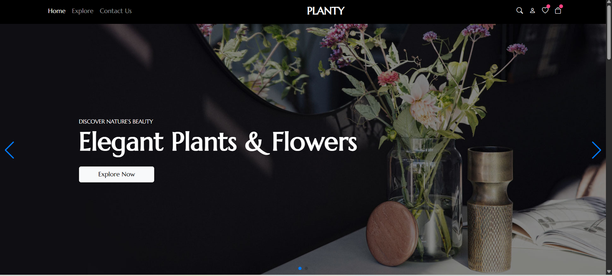
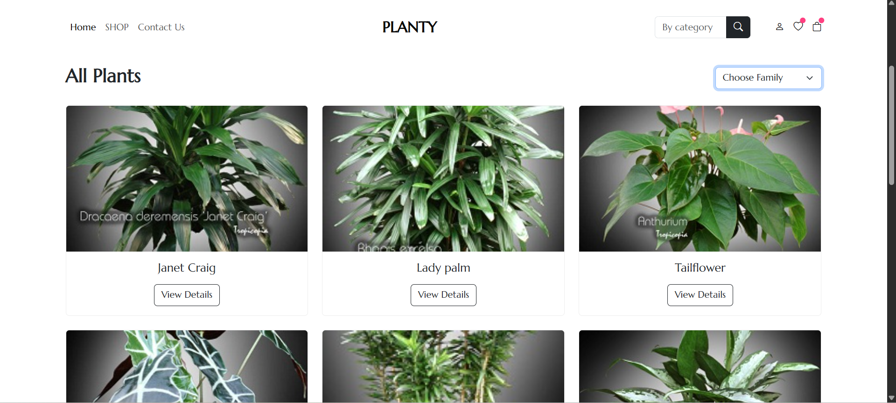
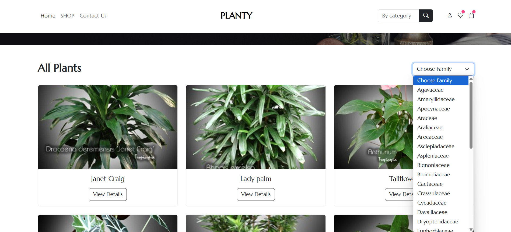
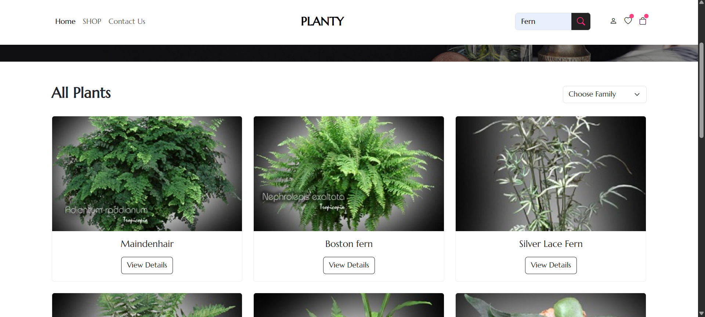
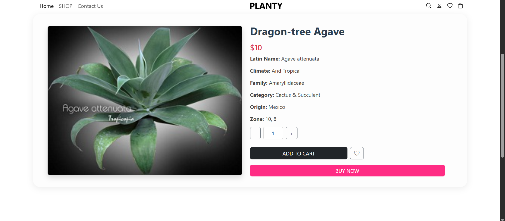
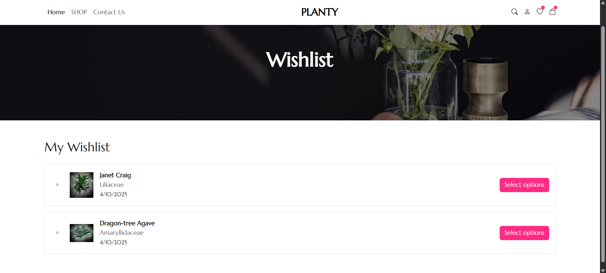

# 🌿 Planty - House Plants Explorer

This is a web-based project that fetches and displays house plants data using a public API. The project was developed for **Assignment 1** in the **Web Services course** to demonstrate how to consume RESTful APIs using JavaScript.

## 📌 API Used

**API Provider:** House Plants 2  
**Platform:** [RapidAPI](https://rapidapi.com/mnai01/api/house-plants2)  
**Endpoint Used:**  
`GET https://house-plants2.p.rapidapi.com/all-lite`

`GET https://house-plants2.p.rapidapi.com/category/{category}`

This API provides a list of plants with their Latin name, common name, family, climate, zone, origin, image, and more.

## 🧪 Features

- Fetch data using `fetch()` from the RapidAPI endpoint.
- Display a paginated list of plants.
- Filter plants by **family**.
- Search by category Using endpoint
- View detailed information for each plant.
- Add plants to a **wishlist** (stored using `localStorage`).
- Responsive and modern UI with Bootstrap 5.

---

## 🖼️ Screenshots and Descriptions

### 1. Homepage - Elegant Landing  
  
**Description**: The homepage offers a clean and elegant landing interface for PLANTY, including an “Explore Now” button that takes the user to the plant browsing page.

---

### 2. All Plants Page - Filtering with API  
  
**Description**: This section fetches all plants from the external API (House Plants 2 via RapidAPI) and allows filtering by **family**. Each plant card includes a picture, name, and a button to view details.

---

### 3. Family Filtering  
  
**Description**: When a plant family is selected from the dropdown menu, the view is filtered to show only plants that belong to that family, based on the fetched API data.

---

### 4. Category Search

**Description**: When a user types a keyword (like "Fern") and clicks the Search button, a request is sent to the API’s /category/{name} endpoint. The view updates to show only the plants that belong to that category, offering a more focused browsing experience.

### 5. Plant Details Page  
  
**Description**: When clicking "View Details", users are taken to a dedicated page showing complete plant information, including its Latin name, family, climate, and more. It includes an "ADD TO CART" button and a heart icon to add the plant to the wishlist.

---

### 6. Wishlist Page  
  
**Description**: The Wishlist page displays all the plants added by the user. It’s styled cleanly and includes a remove button and a “Select options” button for future customizations.

---

## ✍️ Developed By

**Shahd — Computer Science Student at Birzeit University**  
**University ID:** 1221460

**Ghazal Abu Farha — Computer Science Student at Birzeit University**  
**University ID:** 1180533

**Date Submitted:** April 2025

